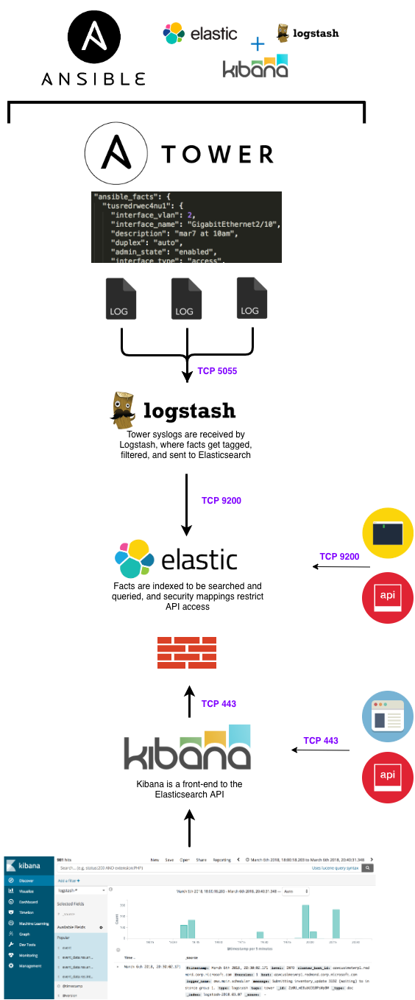

# ELK + Ansible Tower

## Deploy an ELK stack ready to create dynamic inventories from Ansible facts and Tower job results

This role will install and configure an ELK cluster to be used as a search engine and inventory CMDB for Ansible Tower. Once Tower is configured to send logs to ELK, you'll have the ability to quickly and easily search past jobs.

You can search logs/facts to:
  1. Validate changes
  2. Verify job results
  3. Build and manage inventories
  4. Perform security audits
  5. Identify configuration changes
  6. Automate troubleshooting and remediation

Most importantly, this role is the starting point to creating a full-blown inventory CMDB for Tower.




## How Do I Install This Role?

Before running `elk.yaml`, be sure to update your inventory file to add the username and password that Ansible will use. Also, gather facts on inventory hosts first (Elasticsearch setup will fail trying to use the host memory fact).

  1. `ansible -m setup all`

Next, run the ELK install role and define a name for the ELK cluster.

  2. `ansible-playbook elk.yaml -e "elk_cluster_name=elk-tower"`

Elasticsearch, Logstash, and Kibana will be installed to their respective inventory groups. Logstash is configured to listen on port 5055, and will tag all messages as 'tower'.


## What Does This Role Do?

### Pre-configuration
  1. Create Elastic package repos
  2. Set firewalld rules to open ports

### Elasticsearch
  1. Install JDK and Elasticsearch
  2. Set JVM min/max memory to 50% of system RAM
  3. Increase vm.max_map_count (large cluster default)
  5. Define cluster nodes and set port (9200, default)
  6. Start service; validate cluster is up and available
  
### Kibana
  1. Install Kibana
  2. Bind to default IP address and set port (5601, default)
  3. Assign Elasticsearch cluster URL
  4. Start service; validate Kibana is up and available
  
### Logstash
  1. Install JDK and Logstash
  2. Place template to set listening address and tag Tower logs
  3. Start service; validate Logstash is up and available


# What is ELK?

## ELK Components

### Elasticsearch
Elasticsearch is a highly scalable, centralized data storage repository. It's a NOSQL-style database with a REST API, and it can be used to store virtually anything of any filetype. I use it to store a combination of raw text, infrastructure syslogs, application messages, JSON/YAML, files (pdf, doc, xml), and diagrams (vizio, pdf, png/jpeg).

### Logstash
Logstash is a data ingestion and processing tool. It is flexible in nature, allows you to easily transform data in any way, and it allows you to send that data to a staggering array of endpoints. I setup Logstash to receive server/network syslogs and Tower job logs, and I setup filters to take those different types of data and extract them into a common data format.

### Kibana
Kibana is the user interface that interacts directly with Elasticsearch. Kibana will display the Elasticsearch indexed data in a visual manner to help end users identify trends. You can easily build and share dashboards with other users and teams.


# Getting Started with ELK


## Logstash 101
The Logstash event processing pipeline has three stages: inputs → filters → outputs. Inputs generate events, filters modify them, and outputs ship them elsewhere. Inputs and outputs support codecs that enable you to encode or decode the data as it enters or exits the pipeline without having to use a separate filter.

### Configuration
Our Logstash receives messages from Tower, performs aggregation and filtering, and then forwards parsed messages to Elasticsearch to be indexed. Tower's logging settings are straight-forward and support shipping messages via HTTP/HTTPS, TCP, or UDP. As you can see from the settings below, you need only to choose the logging aggregator type (Logstash) and enter the host and port of the syslog destination.

Logstash filtering is configured via plugins, through the following file:
`/etc/logstash/conf.d/logstash.json`

Here's an example configuration that will listen on port 5055, tag all messages with `tower`, and forward them to Elasticsearch over port 9200:

```
input {
  http {
    port => 5055
    tags => "tower"
  }
}

filter {
  json {
    source => "message"
    remove_field => [ "headers" ]
  }
}

output {
  elasticsearch {
    hosts => "hostname:9200"
  }
}
```

### Plugins
#### Input
You use inputs to get data into Logstash. In the above Logstash config, I've setup an HTTP input on port 5055 to match Tower's HTTP log shipping method, and any messages it receives have a new field added: `tags: [ tower ]`. Additional inputs can be configured on other ports.
[See the full list of input types](https://www.elastic.co/guide/en/logstash/current/input-plugins.html).

#### Filtering
Filters are intermediary processing devices in the Logstash pipeline. You can combine filters with conditionals to perform an action on an event if it meets certain criteria. By default, Tower ships messages in a standard syslog format with the `message` field containing JSON. The above filter specifies to parse the `message` field as raw JSON.
[See the full list of plugin types](https://www.elastic.co/guide/en/logstash/current/filter-plugins.html).

#### Output
Outputs are the final phase of the Logstash pipeline. An event can pass through multiple outputs, but once all output processing is complete, the event has finished its execution. After receiving and filtering messages, Logstash outputs to Elasticsearch for daily indexing.
[See the full list of output types](https://www.elastic.co/guide/en/logstash/current/output-plugins.html).

#### Codecs
Though not used [yet] in our setup, codecs are basically stream filters that can operate as part of an input or output and enable you to easily separate the transport of your messages from the serialization process.
[See the full list of codec types](https://www.elastic.co/guide/en/logstash/current/codec-plugins.html).


## Elasticsearch 101

### Searching Logs

After receiving and filtering Tower syslogs, Logstash forwards parsed messages to Elasticsearch where it then creates daily indexes for all logs. If you perform a basic search, it will return every individual log/message based on the timestamp at which it was received. 

Below is an example of an indexed fact collection message. Note that data from any/all fields can be queried independently.

```
{
  "_index": "logstash-date",
  "_type": "logstash",
  "_id": "AV53BdXOS2azg4aDEJWy",
  "_score": 1,
  "_source":
  {
    "play": "collect device facts and display OS version",
    "parent": null,
    "role": "network_facts",
    "stdout": "\u001b[0;32mok: [cisrtrwec]\u001b[0m",
    "start_line": 231,
    "event_data": {
      "play": "collect device facts and display OS version",
      "event_loop": null,
      "remote_addr": "rhel8-lab",
      "res": {
        "_ansible_no_log": false,
        "ansible_facts": {
          "hostname": "rhel8-lab"
        },
        "changed": false
      },
      "role": "network_facts",
      "task_args": "hostname=rhel8-lab",
      "pid": 3,
      "play_pattern": "all",
      "playbook_uuid": "703e7b8b-f22f-46f2-838d-e855f3ece15e",
      "task": "set hostname fact",
      "host": "rhel8-lab",
      "task_path": "/var/lib/awx/projects/_7__ansible_network/roles/network_facts/tasks/cisco-nxos.yml:19",
      "task_uuid": "000d3af9-c8e6-2aaa-f2e7-0000000000dd",
      "play_uuid": "000d3af9-c8e6-2aaa-f2e7-000000000022",
      "playbook": "facts.yml",
      "task_action": "set_fact"
    },
    "type": "logstash",
    "uuid": "341c2bc0-c2b9-4a55-bddf-a4050003049f",
    "event_display": "Host OK",
    "end_line": 232,
    "@version": "1",
    "host": rhel8-lab,
    "modified": "2017-09-12T16:57:04.000Z",
    "id": 7996,
    "logger_name": "awx.analytics.job_events",
    "event": "runner_on_ok",
    "playbook": "facts.yml",
    "level": "INFO",
    "created": "2017-09-12T16:57:04.000Z",
    "failed": false,
    "counter": 272,
    "message": "Job event data saved.",
    "tags": [ "tower" ],
    "@timestamp": "2017-09-12T16:57:04.382Z",
    "parent_uuid": "000d3af9-c8e6-2aaa-f2e7-0000000000dd",
    "task": "set hostname fact",
    "cluster_host_id": "localhost",
    "job": 82,
    "verbosity": 0,
    "host_name": "rhel8-lab",
    "changed": false
  },
  "fields": {
    "modified": [
      1505235424000
    ],
    "created": [
      1505235424000
    ],
    "@timestamp": [
      1505235424382
    ]
  }
}
```


### Finding Ansible Facts 
In the example log above, I'm looking for fact collection messages. In this case, the one I found here would be a hostname fact: `event_data.res.ansible_facts.hostname`

```
"_source": {
    "event_data": {,
      "res": {
        "ansible_facts": {
          "hostname": "rhel8-lab"
```

Also of interest would be the Tower Job ID, playbook task, and inventory hostname target. These are usually what I look for to begin validating job results.

```
"job": 82

"event_data.res.task": "set hostname fact"
"event_data.res.task_action": "set_fact"

"hostname": rhel8-lab                    # This one is from Tower job logs
"event_data.res.hostname": rhel8-lab     # This one is from Ansible playbook results
```


# Integrating Elasticsearch with Tower

## Searching Facts/Logs and Adding Inventories

So you have Tower logging to ELK. Now you can search all of those logs and begin correlating data! Here's a playbook that will get you started searching. In the example below, it will:
  1. Search Ansible facts for anything with a configured wireless device
  2. Create and display a list of unique hostnames
  3. Add hostnames to inventory and run a fact collection role to discover them

In the example below, these are the interesting vars:
  1. `search_fact` is looking for a particular Ansible fact. Another example could be the hostname fact, `ansible_facts.hostname`.
  2. `search_term` is the query string that gets posted to Elasticsearch. In this case, I'm looking for `wlan ssid-profile`.

To run this playbook:

`ansible-playbook elk.yaml -e "cluster_fqdn=elk.server.com,search_fact=config.wlan,search_term=wlan ssid-profile"`

```
---
- name: elk search workflow
  hosts: localhost
  gather_facts: false

  tasks:
  - name: search elasticsearch for job id
    uri:
      url: "http://{{ cluster_fqdn }}:9200/_search"
      method: "GET"
      body_format: "json"
      body: >
        {
           "query": {
            "match_phrase": {
              "ansible_facts.{{ search_fact | default('config.wlan') }}": {
                "query":"{{ search_term | default('wlan ssid-profile') }}"
              }
            }
          }
        }
        '
      headers:
        Content-Type: "application/json"
      #client_cert: /etc/ssl/cert.pem
      #client_key: /etc/ssl/cert.key
    register: elk_search

  - name: retrieve a list of hostnames
    set_fact:
      elk_hostnames: "{{ elk_search.json.hits.hits | map(attribute='_source.ansible_facts.hostname') | list | unique | lower }}"

  - name: retrieve hostnames from search results
    debug:
      var: elk_hostnames

  - name: add hostnames to playbook inventory
    add_host:
      hostname: elk_hostnames
      inventory_dir: "inventory"

- name: run role against search result hostnames
  hosts: "{{ hostvars['localhost']['elk_hostnames'] }}"
  gather_facts: false
  connection: local
  roles:
    - role: network-facts
```

This is a nifty example of using Elasticsearch to create dynamic inventories. Simply put, this is the starting point to creating an inventory CMDB.
